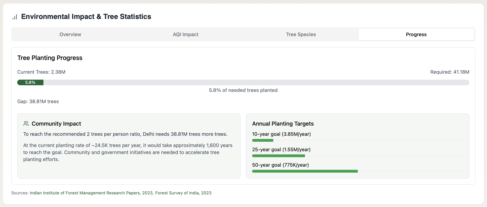

# 🌳 MyTreeMap


## An interactive urban forestry platform for Indian cities

MyTreeMap is an open-source platform that maps, monitors, and celebrates India's urban forests. The project aims to create awareness about the importance of trees in our cities and provide valuable data for urban forest management and conservation efforts.

**Live Demo:** [https://mytreemap.netlify.app](https://mytreemap.netlify.app)

<div align="center">

[](https://github.com/liveupx/MyTreeMap)
[](https://opensource.org/licenses/MIT)
[](https://app.netlify.com/sites/mytreemap/deploys)

</div>

## 📸 Screenshots

<div align="center" style="display: grid; grid-template-columns: repeat(auto-fit, minmax(300px, 1fr)); gap: 20px; margin: 30px 0;">





</div>

## 📊 Environmental Impact Data (2024)

| City       | 🌳 Trees | 🌿 CO₂ Sequestration | 💨 AQI Improvement |
|------------|-------|-------------------|-----------------|
| Delhi      | 2.38M | 18,000 tons/yr    | 15-20 points    |
| Mumbai     | 1.2M  | 12,500 tons/yr    | 10-15 points    |
| Bangalore  | 1.8M  | 8,000 tons/yr     | 8-12 points     |

## 🏛️ Government Initiatives

### National Programs
- **Green India Mission**: ₹944 Cr allocated
- **Nagar Van Yojana**: 546 urban forests approved
- **Ek Ped Maa Ke Naam**: 135 crore trees target

### State Highlights
- **Delhi**: Tree Transplantation Policy
- **Maharashtra**: Mangrove Cell
- **Karnataka**: Urban Forestry Project

## ✨ Features

- 🗺️ **Interactive Tree Map**: Explore tree locations across major Indian cities
- 📈 **City Statistics**: View detailed tree statistics for each city
- 🌤️ **Air Quality Data**: Real-time AQI data and its correlation with tree cover
- 📱 **Embeddable Widgets**: Free widgets to share tree data on your website
- 🌿 **Environmental Impact**: Visualize the benefits of urban trees on air quality and climate
- 📚 **Research Integration**: Access to research papers and methodologies

## 🏙️ City Coverage

The platform currently includes data for the following cities:

<div style="columns: 2;">

- 🏙️ Delhi
- 🏙️ Mumbai
- 🏙️ Bangalore
- 🏙️ Chennai
- 🏙️ Kolkata
- 🏙️ Hyderabad
- 🏙️ Ahmedabad
- 🏙️ Pune

</div>

*More cities are being added regularly*

## 🛠️ Technologies Used

<div style="display: flex; flex-wrap: wrap; gap: 10px;">


</div>

- 🎨 shadcn/ui components
- 📊 Recharts for data visualization
- 🔍 Lucide Icons for beautiful iconography
- 🔄 TanStack Query for efficient data fetching

## 🚀 Running Locally

1. Clone the repository:

```bash
git clone https://github.com/liveupx/MyTreeMap.git
cd MyTreeMap
```

2. Install dependencies:

```bash
npm install
```

3. Create a `.env` file in the root directory with:

```
VITE_MAPBOX_TOKEN=pk.YOUR_OWN_TOKEN_KEY
```

4. Start the development server:

```bash
npm run dev
```

5. Open [http://localhost:3000](http://localhost:3000) in your browser

## 📁 Project Structure

```
src/
├── components/           # UI components
│   ├── ui/               # shadcn/ui components
│   ├── MapBox.tsx        # Map rendering component
│   ├── StatsPanel.tsx    # City statistics visualizations
│   └── ...               # Other components
├── pages/                # Application pages
│   ├── Index.tsx         # Homepage
│   ├── About.tsx         # About page
│   └── ...               # Other pages
├── hooks/                # Custom React hooks
├── lib/                  # Utilities and helper functions
├── App.tsx               # Main application component
└── main.tsx              # Application entry point
```

## 🔌 Embedding Widgets

MyTreeMap provides free embeddable widgets that can be added to any website:

1. Visit [https://mytreemap.netlify.app/widgets](https://mytreemap.netlify.app/widgets)
2. Choose a widget type (Tree Count, AQI, or Statistics)
3. Customize the widget
4. Copy the embed code and paste it into your website

Example embed code:

```html
<iframe 
  src="https://mytreemap.netlify.app/embed?city=Delhi&type=treeCount&theme=light" 
  width="300" 
  height="200" 
  frameborder="0"
  title="MyTreeMap - Delhi tree count widget"
></iframe>
```

## 👥 Contributing

We welcome contributions from developers, data scientists, urban planners, and tree enthusiasts!

### How to contribute:

1. Fork the repository
2. Create a feature branch: `git checkout -b feature/amazing-feature`
3. Commit your changes: `git commit -m 'Add some amazing feature'`
4. Push to the branch: `git push origin feature/amazing-feature`
5. Open a Pull Request

For major changes, please open an issue first to discuss what you would like to change.

## 📊 Data Sources & Methodology

MyTreeMap uses data from various sources, including:

- 🏙️ Municipal corporation tree censuses
- 🛰️ Satellite imagery analysis
- 👥 Community reporting
- 🔬 Scientific research studies

For more information about our data methodology, visit [https://mytreemap.netlify.app/methodology](https://mytreemap.netlify.app/methodology)

## 📞 Contact & Support

- ✉️ **Email**: mohit@liveupx.com (For support/help/donations)
- 💼 **General Inquiries**: ceo@liveupx.com
- 🔌 **More Widgets**: [https://widgetx.site](https://widgetx.site)

## 🤝 Partners

<div style="display: grid; grid-template-columns: repeat(auto-fit, minmax(200px, 1fr)); gap: 10px; margin-top: 10px;">

[](https://liveupx.com)
[](https://mentorji.live)
[](https://widgetx.site)
[](https://sayearth.org)
[](https://caringadoptions.org)
[](https://pitch-deck.agency)
[](https://gurjar.app)
[](https://alfacare.org)

</div>

## 📄 License

This project is licensed under the MIT License - see the [LICENSE](LICENSE) file for details.

## 🙏 Acknowledgments

- 👨‍💻 Developed by Mohit Chaprana, Founder of [Liveupx.com](https://liveupx.com)
- 🌆 Inspired by NYC's Tree Map project
- 🤝 Thanks to all our [partner organizations](https://mytreemap.netlify.app/partners)
- ✨ Special thanks to all contributors and tree enthusiasts
